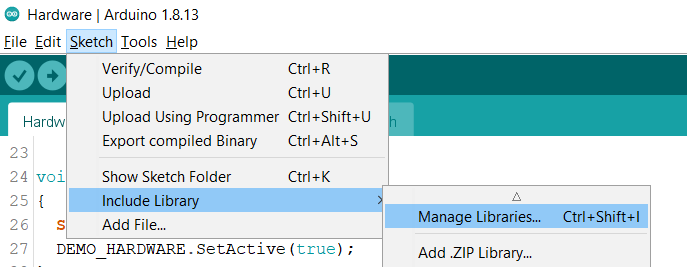
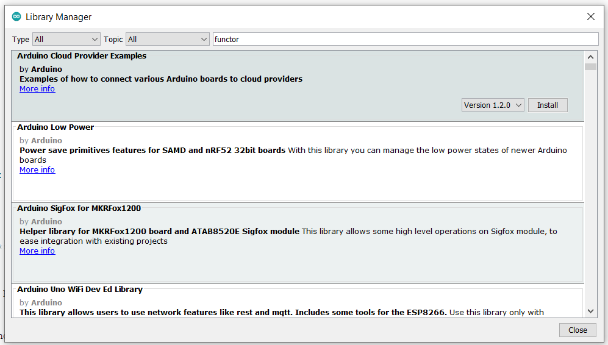
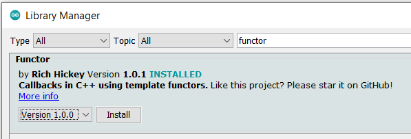
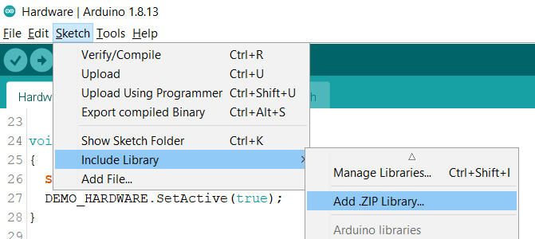
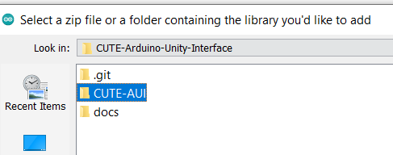
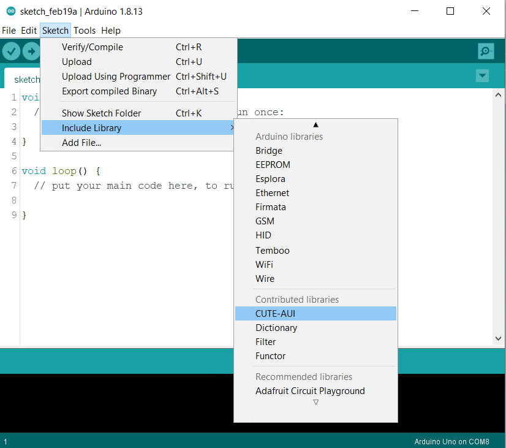
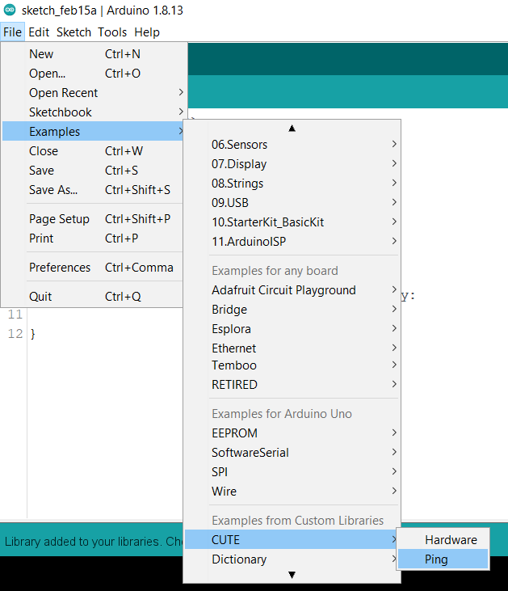

# Getting Started

## 1. Install Arduino IDE

Install the Arduino IDE from https://www.arduino.cc/en/software/. This will be used to develop, compile and deploy embedded software to the hardware device.

## 2. Install CUTE-AUI
The following steps illustrate how to install a local library to use with Arduino

### 2.1 Install CUTE-AUI Dependencies
Within the Arduino IDE, select `Sketch > Include Library > Manage Libraries...` to open up the Library Manager.

Search for the Functor library and install.

### 2.2. Install CUTE-AUI Library
Next, we will install the CUTE-AUI Library from a local folder. Select `Sketch > Include Library > Add .ZIP Library` to open up the file explorer interface.

Navigate to and select the CUTE-AUI folder.

### 2.3 Verify

Verify the installation by locating the CUTE library in the Arduino IDE library dropdown i.e. `Sketch > Include Library`.
You should be able to find both CUTE and the other installed libraries.

You should also be able to open up the sample code by navigating to the examples dropdown `File > Examples > CUTE`.

These examples demonstrate some sample interactions to be used with an application with the CUTE-AUI protocol.

## Required Libraries

[Functor v1.0.1 by Rich Hickey](https://github.com/janelia-arduino/Functor.git)