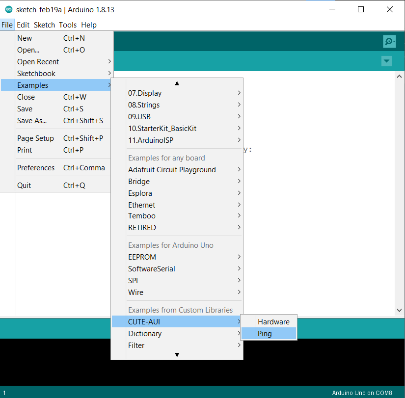
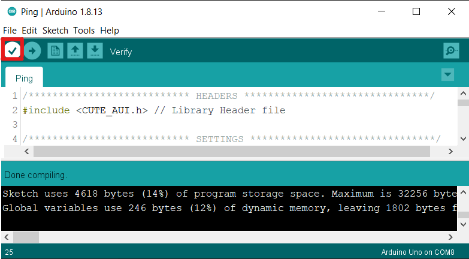
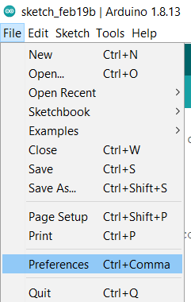
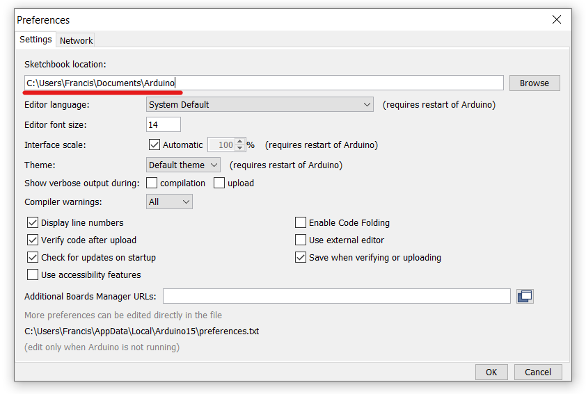
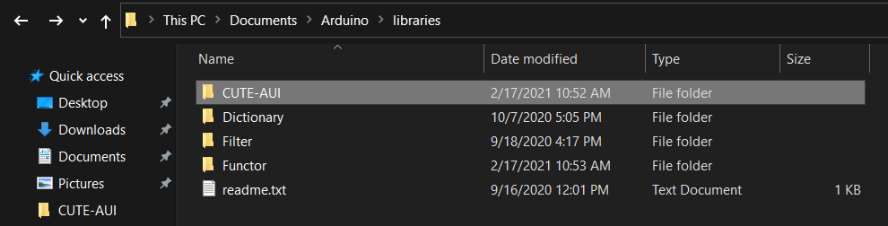

# Getting Started

## 1. Install Arduino IDE

Install the Arduino IDE from https://www.arduino.cc/en/software/. This will be used to develop, compile and deploy embedded software to the hardware device.

## 2. Install CUTE-AUI
The following steps illustrate how to install a local library to use with Arduino

### 2.1 Install CUTE-AUI Dependencies
Within the Arduino IDE, select `Sketch > Include Library > Manage Libraries...` to open up the Library Manager.

Search for the Functor library and install.

### 2.2. Install CUTE-AUI Library
Next, we will install the CUTE-AUI Library from a local folder. Select `Sketch > Include Library > Add .ZIP Library` to open up the file explorer interface.

Navigate to and select the CUTE-AUI folder.

### 2.3 Verify

Verify the installation by locating the CUTE library in the Arduino IDE library dropdown i.e. `Sketch > Include Library`.
You should be able to find both CUTE and the other installed libraries.

Next, open up the Ping.ino example sketch. Do so by navigating to the examples dropdown `File > Examples > CUTE > Ping`.
These examples demonstrate some sample interactions to be used with an application with the CUTE-AUI protocol.

Lastly, verify that the sketch can be compiled successfully by clicking the check mark on the top left hand corner. You should see that the sketch has been successfully compiled.

# Uninstall
To uninstall the library, simply delete the CUTE-AUI folder in your Arduino Libraries directory. You can find the folder path of the libraries folder in your preferences, under `Sketchbook location`.

Simply navigate to `<Arduino-Sketchbook-Location>/libraries and` 
delete the `CUTE-AUI` folder.

# Updating
To update the library, first uninstall the library and then install it again.

# Library Dependencies

[Functor v1.0.1 by Rich Hickey](https://github.com/janelia-arduino/Functor.git)